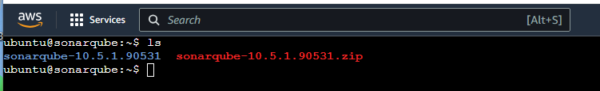
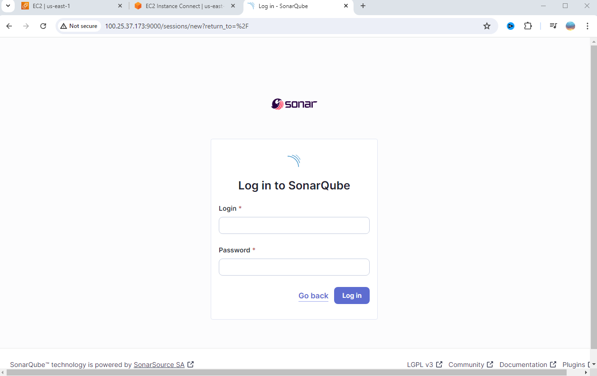
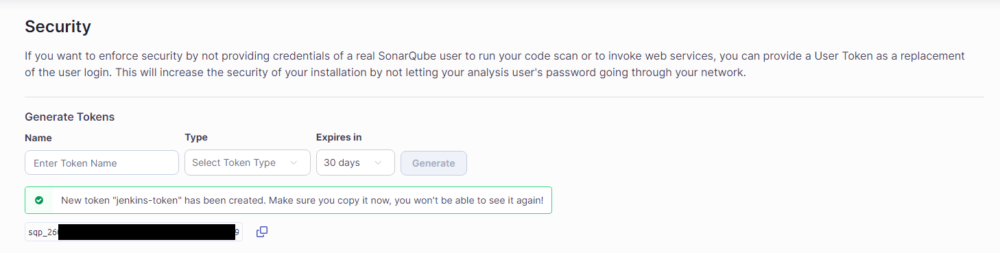
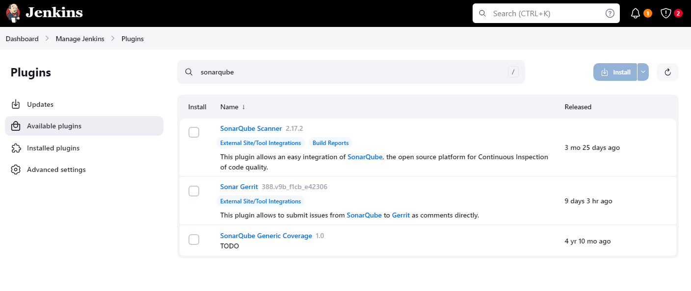
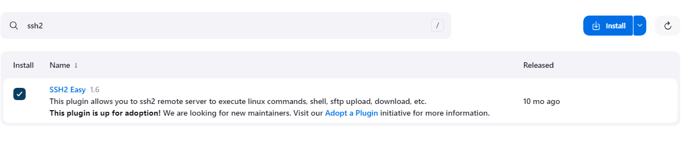
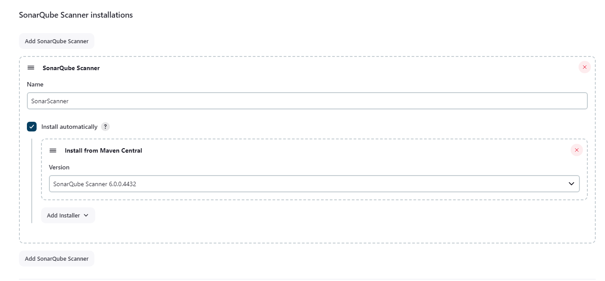
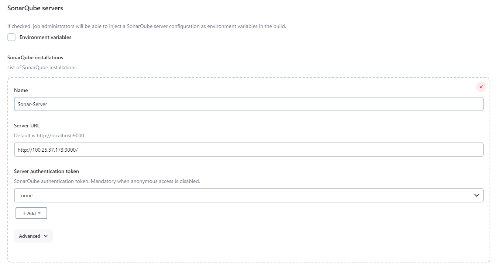
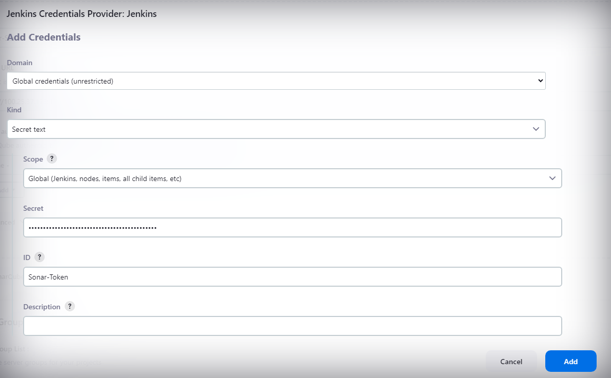
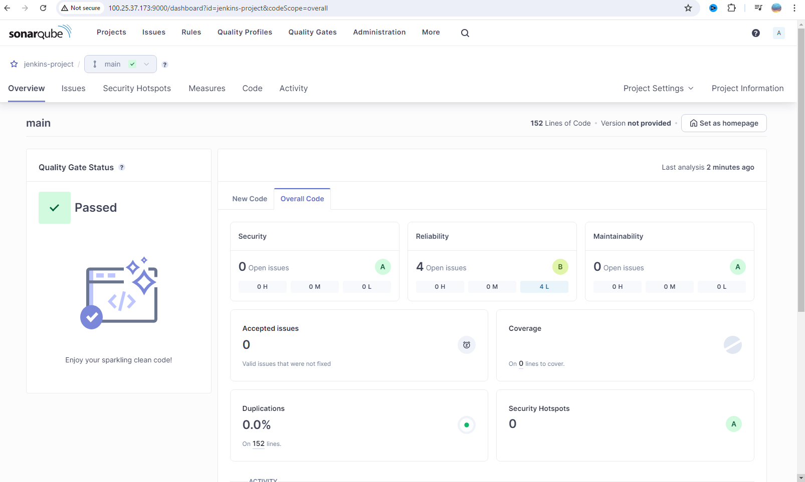

## Overview

This project demonstrates creating a Continuous Integration and Continuous Deployment (CI/CD) pipeline using Jenkins, SonarQube, and Docker. Engineers can commit code to GitHub, which will then be checked and analyzed by SonarQube for errors. If the code passes the analysis, it will be deployed by Docker. Jenkins is used to automate this process, where a GitHub webhook triggers Jenkins to start the pipeline.

## Services Used

- **AWS EC2**: Created three instances—one for Jenkins, one for SonarQube, and another for Docker.
- **Jenkins**: Used for continuous integration when changes are committed to GitHub.
- **SonarQube**: Analyzes code for issues/bugs automatically when code is committed to the pipeline via GitHub.
- **Docker**: Deploys the application automatically once tests pass from SonarQube.
- **GitHub**: Stores my resume website HTML file and Dockerfile and triggers Jenkins with a webhook upon code commits.
- **HTML**: Displays my resume webpage.

## Steps

### Step 1: Creating the Basic Setup

For this step, I started by creating a basic HTML webpage to be displayed. Then, I set up three separate EC2 instances: one for Jenkins to handle continuous integration, another for SonarQube to check and analyze the code, and the last one for Docker deployment.

  
   
  <small>Project Image: The three EC2 instances that will be used in my CI/CD pipeline.</small>

 
 
 
 

### Step 2: Setting Up Jenkins

Next, I shelled into my Jenkins instance and installed a Java JRE. This allowed me to install Jenkins on the instance. After installing Jenkins, I went into my EC2 instance's security group and opened port 8080 so that I could configure Jenkins settings via the internet using my instance's IP. I then used the `systemctl status jenkins` command to get my secret key, which I needed to set up Jenkins properly. Inside the Jenkins configuration, I provided my GitHub link along with the correct branch and selected ‘GitHub hook trigger for GITScm polling’ to enable continuous integration whenever changes are made to GitHub.

  
   
  <small>Project Image: Exposing port 8080 so that I can use the Jenkins dashboard when it’s set up in my EC2 instance.</small>

 
 
 

  
   
  <small>Project Image: Jenkins is up and running on the instance. Although I will clean up after this project and the IP address will no longer be in use, it's generally a good practice to avoid exposing or displaying IP addresses. This caution helps protect against potential bad actors, even if the instance is virtual.</small>

 
 
 
 

  
   
  <small>Project Image: Installing default plugins via the Jenkins dashboard.</small>

 
 
 
 

### Step 3: Testing the Jenkins Pipeline

To test the Jenkins pipeline I previously created, I set up a webhook for my GitHub repository. To check if everything was working, I created a new text file in my GitHub repository called ‘Jenkins Test’. Once I committed and pushed the file, I checked Jenkins to see if it triggered the pipeline, which it did. This confirmed that the pipeline up to this point was functioning automatically.

  
   
  <small>Project Image: Setting up my webhook to invoke Jenkins whenever code is committed to my GitHub repository.</small>

 
 
 
 

  
   
  <small>Project Image: Initial Jenkins build, so that I can test continuous integration.</small>

 
 
 

  
   
  <small>Project Image: Console output</small>

 
 
 
 

  
   
  <small>Project Image: Pipeline before the test commit to GitHub.</small>

 
 
 
 

  
   
  <small>Project Image: Test file that I’m going to commit to my GitHub repository to test that Jenkins is continuously integrating changes I have committed (Filename 'Jenkins test').</small>

 
 
 
 

  
   
  <small>Project Image: Build after the commit.</small>

 
 
 
 

  
   
  <small>Project Image: Success, Jenkins integrated the commit from Jenkins into the pipeline which is proof of continuous integration.</small>

 
 
 
 

### Step 4: Setting Up SonarQube

For this step, I configured and set up SonarQube on my second EC2 instance for continuous code analysis. This involved installing all the necessary components, including SonarQube, and exposing port 9000 so I could use the web GUI with the instance IP. From there, I set up and generated a token to use in Jenkins. After the configuration, I built my pipeline and checked on the SonarQube website to see if my code passed the test, which it did. This meant I could now deploy the passed code to Docker, tying up my project where I can commit code, and if it passes, it will be continuously deployed to Docker.

  
   
  <small>Project Image: Used 'wget' command to install SonarQube on my instance and used the unzip command to retrieve its contents.</small>

 
 
 
 

  
   
  <small>Project Image: SonarQube is up and running.</small>

 
 
 
 

  
   
  <small>Project Image: Generating a SonarQube token so that SonarQube can be implemented into my Jenkins pipeline.</small>

 
 
 
 

  
  
   
  <small>Project Image: Installing appropriate Jenkins plugins to use with SonarQube.</small>

 
 
 
 

  
   
  <small>Project Image: Configuring the SonarQube scanner on Jenkins.</small>

 
 
 
 

  
   
  <small>Project Image: Configuring the SonarQube server on Jenkins.</small>

 
 
 
 

  
   
  <small>Project Image: Configuring the SonarQube token.</small>

 
 
 
 

  
   
  <small>Project Image: Finally, after configuring SonarQube to work with Jenkins, I rebuilt my pipeline and SonarQube is successfully scanning and checking for code errors continuously/automatically whenever a commit is made to my GitHub repository.</small>

 
 
 
 

### Step 5: Configuring Docker

In my third and final instance, the task was to set up Docker so that Jenkins on my first instance could connect to the Docker server to implement continuous deployment for my simple HTML resume website when I commit
